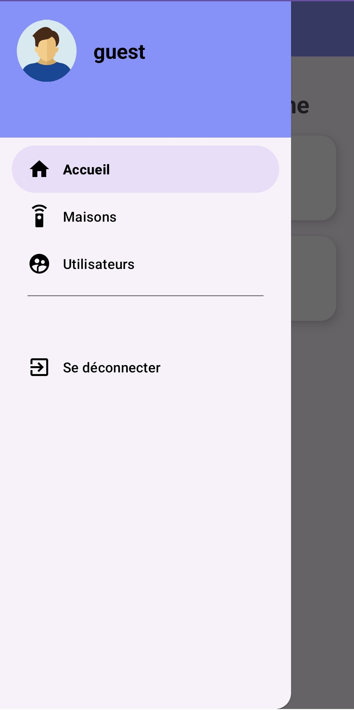
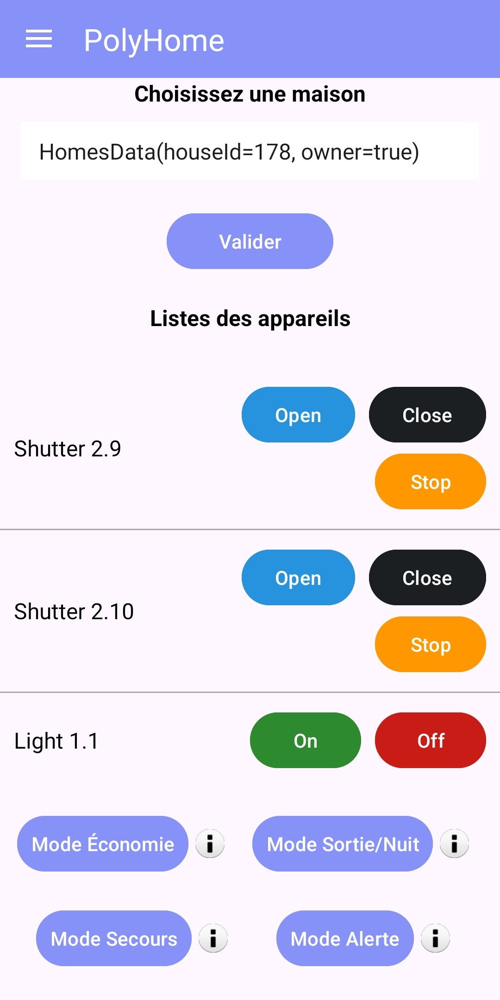

# PolyHome - Mobile Application for Home Automation  

## Table of Contents
- [Project Description](#project-description)
- [Implemented Features](#implemented-features)
  - [Core Features](#core-features)
  - [Bonus Features](#bonus-features)
- [Download](#download)
- [Or Install](#or-install)
- [Screenshots](#screenshots)
  - [Login and Register](#login-and-register)
  - [Home Page](#home-page)
  - [Manage Users and Devices](#manage-users-and-devices)
- [Author](#author)

## Project Description  
PolyHome is an Android home automation application designed to control connected devices in a house, such as rolling shutters, lights, and garage doors. This application leverages a pre-existing API to provide an intuitive interface with features tailored to user needs.  

**Link to the Virtual Model**: [PolyHome - Model](https://polyhome.lesmoulinsdudev.com?houseId=<houseId>)  

## Implemented Features  
### Core Features  
1. **User Account**  [screenshots](#login-and-register)
   - Create an account with login and password.  
   - Login using an authentication token stored locally to avoid re-entering credentials after the first login.  
   - Log out from the application.

2. **Home Page**  [screenshots](#home-page)
   - Displays the number of houses the user can control *(bonus)*.  
   - Displays the number of users with access to the user's house *(bonus)*.  

3. **House List**  [screenshots](#manage-users-and-devices)
   - Shows houses associated with the user, whether as an owner or guest *(bonus)*.  

4. **User Management**  [screenshots](#manage-users-and-devices)
   - List users who currently have access to the house *(bonus)*.  
   - Grant access to a house to another user *(bonus)*.  
   - Revoke access for specific users *(bonus)*.  

5. **Connected Devices**  [screenshots](#manage-users-and-devices)
   - Display the list of devices in a house.  
   - Send commands to devices (lights, shutters, doors, etc.).  
   - Control devices in houses where the user has access *(bonus)*.  

### Bonus Features  
1. **Predefined Modes**  [screenshots](#manage-users-and-devices)
   - **Economy Mode**: Turns off all lights to reduce energy consumption.  
   - **Night/Exit Mode**: Turns off all lights and closes all shutters and doors.  
   - **Emergency Mode**: Opens all doors and shutters and turns off all lights.  
   - **Alert Mode**: Blinks all lights and opens all shutters and doors.  

2. **Enhanced User Interface** [screenshots](#screenshots)
   - Informational buttons provide contextual explanations for actions.  
   - Ergonomic and user-friendly design for seamless navigation.  

## Download
Download the latest version of the PolyHome application [here](https://github.com/Noureddine-t/PolyHome/releases/).

## Or Install  

1. Open the project in **Android Studio**.  

2. Run the application on an **emulator** or a **physical device**.  

3. Launch the app and either:  
   - **Create your own account**. or
   - **Use the guest account**:  
     - Login: `guest`  
     - Password: `guest`  

4. Make sure to open the virtual model of the house in a browser using the following link:  

[https://polyhome.lesmoulinsdudev.com?houseId=`<houseId>`](https://polyhome.lesmoulinsdudev.com?houseId=<houseId>) Replace `<houseId>` with the corresponding house ID you want to control.

## Screenshots

### Login and Register
          

### Home Page
          

### Manage Users and Devices
          

## Author  

This project was developed as part of the **Mobile Programming** course at the **University of Burgundy**.  

- **Name**: Nour Eddine TALEB  
- **Year**: 4th year of Engineering Cycle
- **Specialization**: Software Engineering and Artificial Intelligence (ILIA)